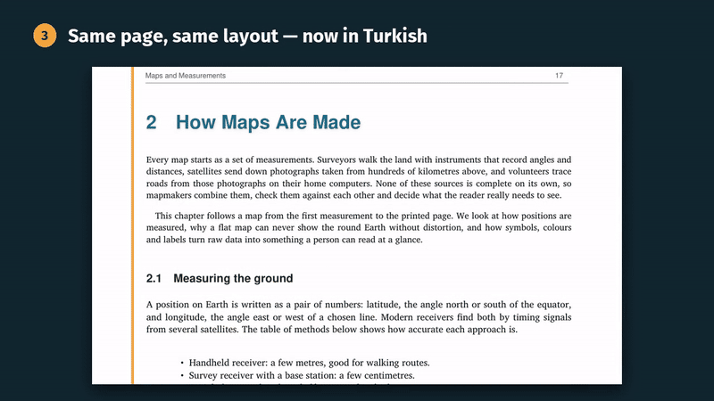
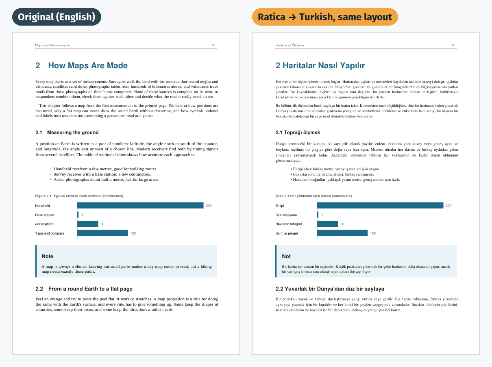
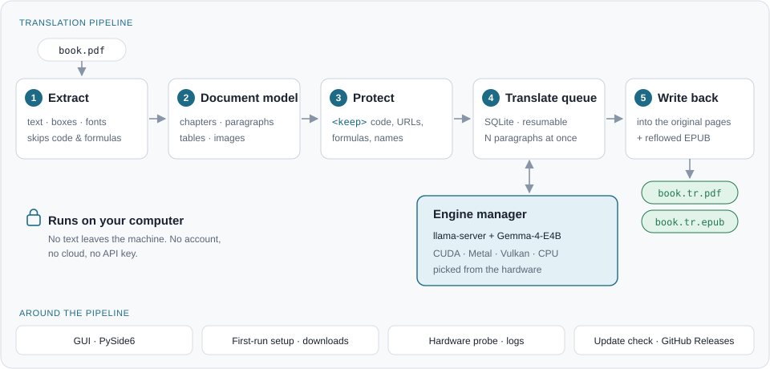
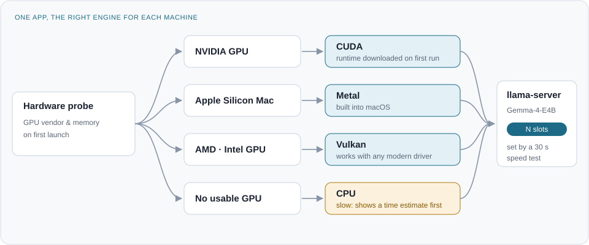

<p align="center">
  
</p>

<h1 align="center">Ratica</h1>
<p align="center"><b>Offline AI PDF translator that keeps the original page layout</b></p>

<p align="center">
  Translate PDF books on your own computer.<br>
  Free, open source and private: no cloud, no account, no API key. Windows · macOS · Linux.
</p>

<p align="center">
  <a href="https://github.com/kaanncavdar/ratica/releases/latest"><b>Download</b></a> ·
  <a href="docs/media/ratica-intro.mp4">Watch the 30-second intro</a> ·
  <a href="#use">How to use</a> ·
  <a href="docs/ARCHITECTURE.md">How it works</a>
</p>

<p align="center">
  
</p>

Ratica is an offline **PDF book translator**. It reads a PDF, translates it paragraph by paragraph with a local AI model ([Gemma](https://ai.google.dev/gemma) running on [llama.cpp](https://github.com/ggml-org/llama.cpp)), and writes the translation back into the original pages: headings, lists, tables of contents, figures, colours and formulas stay where they were. You also get an EPUB for e-readers. Your book never leaves your machine.

> **Status: beta.** Ratica works end to end, but it is young: expect rough edges and please [report them](https://github.com/kaanncavdar/ratica/issues).



## Why Ratica?

Most PDF translators are cloud services: you upload your document, wait, and often get back plain text that
has lost its layout. Ratica is a **local PDF translator** instead. It runs entirely on your own computer with a
local AI model, so it works offline and your files stay private.

- **Layout-preserving PDF translation:** the translated book looks like the original, page by page.
- **Private by design:** no cloud, no account, no API key, no file uploads.
- **Made for long documents:** books, textbooks, manuals and technical documents of hundreds of pages;
  you can pause and resume.
- **PDF and EPUB output:** read the translation as the original pages or on an e-reader.
- **Free and open source** on Windows, macOS and Linux.

Translate between English, Turkish, Spanish, German, French, Japanese, Chinese and 20+ other languages, in
any direction. Ratica recognises the language of the book by itself.

## Install

Download the file for your system from **[Releases](https://github.com/kaanncavdar/ratica/releases)**:

| System | File | Notes |
|---|---|---|
| Windows 10/11 | `Ratica-…-Windows-Setup.exe` | Run it. The installer is not code-signed yet, so Windows may show *"Windows protected your PC"*: click **More info → Run anyway**. |
| macOS (Apple Silicon) | `Ratica-…-macOS-AppleSilicon.dmg` | Open the disk image and drag **Ratica** onto **Applications**. The app is not notarized by Apple yet, so macOS blocks the first start once: click **Done**, open **System Settings → Privacy & Security**, scroll down, click **Open Anyway** next to the Ratica message, enter your password and choose **Open**. After that it opens normally. |
| Linux (x64) | `Ratica-…-Linux-x64.tar.gz` | Unpack and run `Ratica/Ratica`. |

On first start Ratica downloads its translation engine and AI model (about 5–6 GB, once) and measures your computer's speed. After that it works offline.

### Run from source

Download or clone this repository, then double-click **`start.bat`** (Windows) or **`start.command`** (macOS), or run `./start.sh` (Linux). The script installs [uv](https://docs.astral.sh/uv/) if needed, then Ratica's packages, then opens the app.

## Use

1. Choose a PDF or drop it on the window.
2. Pick the language to translate to. The book's own language is recognised for you; change it if needed.
3. Press **Translate**. You can pause and resume at any time; progress is saved.
   Want to try it first? Use the one-page [sample book](docs/demo/sample-book.pdf).
4. The translated `book.<language>.pdf` (same layout as the original) and `book.<language>.epub` are saved next to the original.

There is also a command line:

```
ratica translate book.pdf --to de        # translate (sets itself up on first use)
ratica translate book.pdf --to ja --keep "Kubernetes,Linus Torvalds"
ratica setup                             # download and measure speed now
ratica info                              # hardware and settings, for bug reports
ratica translate book.pdf --to fr --reflow   # typeset a new PDF instead of keeping the layout
```



## Features

- Translates text-based PDF books (textbooks, manuals, papers, novels) **in any direction between 23 languages**:
  Azerbaijani, Bulgarian, Chinese (Simplified), Czech, Dutch, English, French, German, Greek, Hindi, Indonesian,
  Italian, Japanese, Korean, Polish, Portuguese, Romanian, Russian, Spanish, Swedish, Turkish, Ukrainian and
  Vietnamese.
- **Recognises the book's language** by itself; you only choose the language to translate to.
- **Keeps the original layout**: every page stays where it was, with its images, tables, charts, colours and page numbers. Each paragraph is translated in its own box, in a matching serif or sans-serif font; longer translations use free space next to them before the text gets smaller.
- Leaves code, formulas and URLs exactly as they are.
- Also writes an **EPUB**, which reflows nicely on phones and e-readers.
- Resumes where it stopped if the computer sleeps or the app closes.
- Shows a time estimate before starting.
- Sets itself up: it detects your hardware, downloads the right engine and model once, and measures your computer's speed.
- Leaves room for your other work: it never fills the GPU memory and runs at low priority.

## How fast is it?

On an entry-level gaming GPU with 6 GB of memory, a 200-page book takes about **30–45 minutes**. Faster GPUs finish sooner because they translate more paragraphs at once. Without a GPU, translation works but takes many hours.

## Requirements

| Hardware | Support |
|---|---|
| NVIDIA GPU with 6 GB or more | ✅ Recommended (CUDA) |
| Apple Silicon Mac (M1 or newer) | ✅ Supported (Metal) |
| AMD or Intel GPU | 🧪 Should work (Vulkan), not yet tested — reports welcome |
| No GPU | ⚠️ Works, but slow |

Windows 10/11, macOS 12 or newer, and Linux. About 6 GB of free disk space for the engine and the model.



## The AI model

Ratica uses **[Gemma-4-E4B-it](https://huggingface.co/google/gemma-4-E4B-it)** (Apache 2.0) through [llama.cpp](https://github.com/ggml-org/llama.cpp). It was chosen after comparing several current open models on translation quality, protection of code and URLs, speed and memory use. The benchmark scripts are in [`bench/`](bench/), so anyone can run the comparison on their own hardware.

## Uninstall

The engine and the AI model (5–6 GB) are kept outside the app, in Ratica's data folder. To free that space
while keeping the app, click **delete** next to *Downloaded engine and model* at the bottom of the window.

- **Windows:** uninstall Ratica from *Settings → Apps*. The uninstaller asks whether to delete the downloaded
  engine and model too.
- **macOS:** delete the downloaded files in the app first (or remove `~/Library/Application Support/Ratica`),
  then move Ratica from Applications to the Trash.
- **Linux:** delete the `Ratica` folder and `~/.local/share/ratica`.

Translated books and their saved progress (`book.<language>.ratica` folders) stay next to your PDFs; delete
them like any other file.

## Privacy

Everything runs locally. Ratica only goes online to download the engine and the model on first launch. It never uploads your files or text.

## Known limitations

- Scanned PDFs (pages that are images) are not translated yet; OCR is planned.
- Text inside images stays in the original language.
- Formulas are kept exactly as they are, so a sentence that is part of a formula stays in the original language.
- Pages rotated sideways (wide tables) stay in the original language.
- When a paragraph mixes styles (an italic phrase, a coloured link), the translation uses the paragraph's main
  style for all of it.
- If a translation cannot fit its place on the page at a readable size, that text keeps the original.
- The app window is in English for now.

## Roadmap

| v1 (now) | v2 |
|---|---|
| Text PDFs → PDF + EPUB | OCR for scanned pages |
| Code, URL, formula and name protection | Translated diagram labels |
| Resumable, parallel translation | Splitting large tables |
| Automatic hardware setup | Glossary for consistent terms |
| Simple desktop app | Side-by-side preview, translated app window |

Right-to-left scripts and comics (text inside speech bubbles) are ideas for later, not promises.

Read the design in **[docs/ARCHITECTURE.md](docs/ARCHITECTURE.md)**.

## Contributing

Ratica is built in the open and help is welcome, especially:

- **Hardware reports** from AMD, Intel and Apple GPUs: speed, memory use, anything that breaks.
- **Translation quality feedback** in any language.
- Bug reports and pull requests.

## Acknowledgements

[llama.cpp](https://github.com/ggml-org/llama.cpp) · [Gemma](https://ai.google.dev/gemma) · [PyMuPDF](https://github.com/pymupdf/PyMuPDF) · [Noto fonts](https://fonts.google.com/noto) · [FLORES-200](https://github.com/facebookresearch/flores) · [PySide6](https://doc.qt.io/qtforpython-6/)

## License

[AGPL-3.0](LICENSE). Ratica is free and open source. Anyone may use, study and change it; modified versions must stay open source too.
