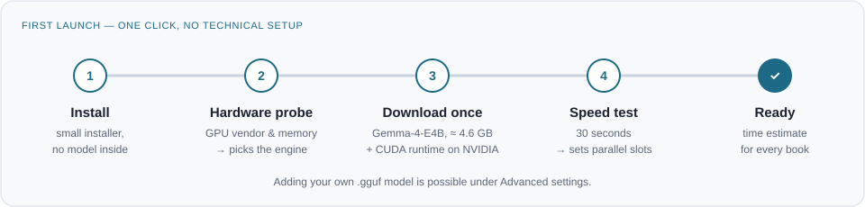

# Architecture

Ratica is a desktop app that translates long technical PDF books **entirely on your computer**. It reads a PDF, translates it paragraph by paragraph with a local language model, and writes the translation as both PDF and EPUB. No text leaves the machine.

This document describes v1. Status: **draft for review** (2026-09-27).


## Design principles

- **Local only.** No cloud, no account, no API key. The model runs through [llama.cpp](https://github.com/ggml-org/llama.cpp).
- **Works for non-technical users.** Installing the app and translating a book happens in the GUI with no terminal and no manual model setup.
- **Honest about time.** Before a book starts, the app shows how long it will take on this machine.
- **Never lose work.** Every translated paragraph is saved at once, so a closed laptop or a crash resumes where it stopped.
- **The computer stays usable.** The engine always leaves GPU memory free (1 GB by default) and runs at normal priority.
- **One code path.** Hardware differences live in the engine build and a few measured numbers, not in `if vendor == ...` branches.

## Modules

| # | Module | Responsibility | Main library |
|---|---|---|---|
| 1 | `extract` | Read text, fonts, positions and images from the PDF. Mark content that must not be translated: code blocks, bibliography, index, repeated headers and footers. Pluggable interface so OCR can be added in v2. | PyMuPDF |
| 2 | `docmodel` | Format-independent book: chapters → blocks (paragraph, heading, list, table, image, code, formula). Every block has a stable ID and a hash of its source text. | dataclasses |
| 3 | `protect` | Wrap spans that must survive unchanged in `<keep>…</keep>`: inline code, URLs, formulas, file paths and names from the user's do-not-translate list. After translation, check that every span came back intact; retry once, then fall back to the source text for that paragraph. | regex |
| 4 | `queue` | Store every block and its state (`pending → translating → done / failed`) in SQLite. Send N blocks to the engine at once. Identical source text is translated once and reused. | sqlite3 |
| 5 | `render` | Build the translated book from the document model: reflowed PDF and EPUB. Pick Noto fonts when the original font lacks the target language's letters and embed only the used glyphs. Formulas are copied as images in v1. | PyMuPDF, ebooklib |
| 6 | `engine` | Start, watch and stop `llama-server` as a child process on `127.0.0.1`. Choose the build (CUDA, Metal, Vulkan, CPU) and the number of parallel slots. | subprocess, httpx |
| 7 | `gui` | Pick a file and target language, see the time estimate, follow progress, open finished chapters while the rest translates. | PySide6 |
| 8 | `setup` | First-launch downloads with progress and checksum verification: the model and, on NVIDIA, the CUDA runtime. | httpx |
| 9 | `update` | Check GitHub Releases on start and offer the new version. | httpx |

The engine is a separate process on purpose: llama.cpp ships ready-made builds for every platform and GPU, so the app never compiles native code, and a crash in the engine cannot take the GUI down.

## Engine and hardware


| Hardware | Engine build | Notes |
|---|---|---|
| NVIDIA GPU | CUDA | Fastest on NVIDIA: CUDA scales with parallel paragraphs much better than Vulkan. The CUDA runtime (~370 MB) is downloaded on first launch, only on NVIDIA machines. |
| Apple Silicon | Metal | Tested on Apple Silicon before each release. |
| AMD or Intel GPU | Vulkan | Not tested yet; community reports welcome. |
| No usable GPU | CPU | Supported but slow: a 200-page book can take many hours. The app says so before starting. |

**Default model:** Gemma-4-E4B-it, GGUF Q4_K_M (≈ 4.6 GB). It was chosen by a blind human comparison and automatic scores; the benchmark scripts are in [`bench/`](../bench/). Machines with more GPU memory can pick a larger model under *Advanced*.

**Parallel slots:** the first-launch speed test runs 1, 2, 4… paragraphs at once and keeps the fastest setting that still leaves the memory margin free. The result is saved and re-measured when the GPU or driver changes.

**Memory check:** the model's needs (weights + KV cache per slot + buffers) are computed from GGUF metadata and compared with free GPU memory before starting. There are no hard-coded thresholds.

## First launch



## Translating a book

1. `extract` + `docmodel` build the book structure. Blocks that will not be translated are marked.
2. The app estimates the time: *remaining words × measured seconds per word*, and shows it.
3. `queue` sends blocks to the engine in reading order, N at a time. Each result goes through `protect`'s check and is saved immediately.
4. Finished chapters can be rendered and opened right away.
5. When all blocks are done, `render` writes `book.<lang>.pdf` and `book.<lang>.epub`.

A project folder next to the book keeps the SQLite queue, so reopening the same PDF continues the job. The source-text hash detects a changed PDF.

**Prompt:** one short system instruction ("translate from X to Y, output only the translation, copy `<keep>` spans unchanged") and one block per request, with temperature 0. Tested: no model in the benchmark added introductions or notes.

## Languages and fonts

- v1 targets left-to-right scripts: Latin (including Turkish and Azerbaijani letters), Cyrillic, Greek, CJK, Devanagari and others.
- Noto fonts for Latin, Cyrillic, Greek and Devanagari ship with the installer; CJK fonts are downloaded when a CJK target language is chosen.
- Right-to-left scripts are out of scope for v1.

## Project layout

```
ratica/
├─ src/ratica/
│  ├─ extract/     # PDF → raw blocks (PyMuPDF), pluggable for OCR
│  ├─ docmodel/    # book structure, IDs, hashes
│  ├─ protect/     # <keep> tagging and checking
│  ├─ queue/       # SQLite job store, parallel dispatch, dedupe
│  ├─ engine/      # llama-server lifecycle, hardware probe, speed test
│  ├─ render/      # PDF + EPUB writers, font fallback
│  ├─ setup/       # downloads with checksums
│  ├─ update/      # GitHub Releases check
│  ├─ gui/         # PySide6 windows
│  └─ cli.py       # same pipeline without the GUI (used first, and by tests)
├─ bench/          # model benchmark scripts and results
├─ docs/           # this document and images
└─ tests/
```

## Build and release

- GitHub Actions builds installers for Windows (`.exe`), macOS (`.dmg`, Apple Silicon) and Linux (AppImage, `.deb`) on every tagged release, using PyInstaller.
- Installers contain the app, the matching llama.cpp build and the base fonts, but **no model**, so they stay small.
- Installers are not code-signed; the README explains the Windows SmartScreen and macOS Gatekeeper warnings.
- License: **AGPL-3.0** (required by PyMuPDF, and it keeps derivatives open).

## Scope

| v1 | v2 | Later ideas (not committed) |
|---|---|---|
| Text PDFs, PDF + EPUB output | OCR for scanned pages (local PaddleOCR) | Right-to-left scripts |
| Code, URL, formula and name protection | Translated diagram labels (numbered legend) | Vertical text |
| Resumable queue, parallel paragraphs | Splitting large tables across pages | Comics and manga: text in speech bubbles |
| Automatic engine and slot selection | Glossary (CSV) for consistent terms | |
| Minimal GUI, update check | Side-by-side preview, mark text not to translate | |

## Build order

1. **CLI end to end:** PDF → document model → translation → PDF/EPUB, tested on an openly licensed 10–20 page PDF.
2. Queue with resume and parallel slots, deduplication, skip rules.
3. Protection checks and font fallback.
4. Engine manager with hardware probe and speed test; first-launch downloads.
5. GUI.
6. Installers and release workflow.
